# Implicit Defaults: A Pilot Study on Demographic Bias in AI Image Generation

*Draft — work in progress*

---

## Abstract

*(To be written once results section is complete.)*

AI image generation models have become widely used tools for creating visual content, yet the demographic assumptions embedded in these models are rarely transparent or examined. This pilot study investigates what happens when demographic attributes are omitted from prompts: which defaults does each model apply silently? We compare the perceived demographic distribution of AI-generated images against reference images from internet search engines and stock photography, and contextualise these against real-world population statistics. Our goal is not to prescribe what AI should generate, but to raise awareness that unspecified prompts silently inherit model-specific biases that are neither documented nor well-studied.

---

## 1. Introduction

When a user prompts an AI image generation model with "a person" or "a CEO", the model must implicitly decide what that person looks like. These decisions — perceived gender, perceived ancestry, age, skin tone — are not random. They reflect patterns learned from training data and design choices made during model development, and they are largely invisible to the user.

This matters in practice. A designer generating placeholder portraits, a researcher illustrating a report, or a developer testing a UI will receive images shaped by these defaults without necessarily realising it. The resulting content may reinforce stereotypes or systematically under-represent large parts of the world population.

This paper makes no normative claims about what AI image generators *should* produce. Instead, it asks a descriptive question: **what do they actually produce by default, and how does that compare to internet image search results and real-world demographics?**

We frame this as a three-layer comparison:

1. **Real-world baseline** — population statistics (e.g. world population by region for "Person"; labour force statistics for occupational prompts)
2. **Internet representation** — what Google Image Search and Adobe Stock return for the same prompt
3. **AI generation** — what leading generative models produce for the same prompt

Each layer can introduce or amplify demographic skew. By making all three visible in one study, we aim to illustrate where bias enters the pipeline and to what degree.

This is an exploratory pilot study. All results are based on small samples (n=24 per source) and should be interpreted as illustrative rather than statistically definitive. However, as we argue in Section 5, strong distributional skews at small sample sizes are informative: a 23/24 result does not become meaningfully different at n=1000.

---

## 2. Related Work

*(To be expanded.)*

- **Gender Shades** (Buolamwini & Gebru, 2018) — audit of facial recognition systems; introduced the "perceived" framing for demographic attributes assessed from visual appearance
- Audit studies of text-to-image models (e.g. Bianchi et al., 2023 — "Easily Accessible Text-to-Image Generation Amplifies Demographic Stereotypes at Large Scale")
- Studies on occupational bias in image search (e.g. Kay et al., 2015 — "Unequal Representation and Gender Stereotypes in Image Search Results")
- *(Add further references as the paper develops)*

---

## 3. Methodology

### 3.1 Prompt design

All images were collected or generated using a single neutral subject prompt per category. For this pilot, the subject is **"Person"** — intentionally generic to surface default assumptions with no occupational or contextual framing. Internet search sources used "Person" as the literal search query.

For AI generative sources, the prompt design followed two constraints. First, the subject phrase was kept as close as possible to the search query: a single unspecified person, with no stated gender, age, ethnicity, nationality, clothing, profession, social setting, or emotional expression. Second, each model was given only the minimal additional wording needed to obtain a usable photorealistic portrait in a broadly comparable image format. Without such wording, some systems may produce illustrations, full-body compositions, abstract images, or inconsistent crops, which would make demographic labeling less reliable and reduce comparability between sources.

The resulting prompts were therefore not identical strings, but model-adapted minimal prompts with the same experimental intent:

| Source | Prompt used | Design rationale |
|---|---|---|
| FLUX | *"A portrait of a person. (hyper realistic, professional photoshoot, 16k)"* | The core phrase *"a person"* leaves demographic attributes unspecified. The added terms encourage a high-resolution photographic portrait, which helps keep the local ComfyUI output close to the reference-image and API-generated formats. |
| FLUX 2 | *"A portrait of a person. (shot on Sony A7IV, 80mm lens, f/2.8, natural lighting)"* | The camera and lighting phrase was used as a compact photographic prior. It encourages realistic portrait framing and natural lighting while avoiding demographic, occupational, or cultural cues. |
| Qwen | *"A photorealistic image of a person."* | Qwen produced suitable outputs with a shorter realism cue, so no camera or studio details were added. This kept the prompt closer to the neutral subject phrase. |
| NanoBanana | *"A photorealistic portrait of a person in 1.2 x 1 format."* | The portrait and aspect-format wording was used to keep API outputs close to the intended crop and image proportions while leaving the subject demographically unspecified. |
| DALL-E | *"A photorealistic portrait of a person."* | DALL-E required only a minimal photorealistic portrait instruction to produce comparable images. No aspect-ratio wording was added beyond the default generation settings. |
| GPT Images 2 | *"A photorealistic portrait of a person."* | The same minimal OpenAI prompt was used for the newer ChatGPT Images 2.0 interface to support direct comparison with the older DALL-E source. |

This design prioritises comparability over literal prompt uniformity. A fully identical prompt would not necessarily produce comparable image types across models, because each system responds differently to sparse prompts and exposes different controls. Conversely, adding detailed style, clothing, location, or camera-scene descriptions would risk introducing new bias cues. The selected prompts therefore aim to isolate the model's implicit demographic defaults while controlling only for image type: a photorealistic portrait of an otherwise unspecified person.

### 3.2 Image sources

Eight sources were used, divided into two groups:

**Reference sources (internet imagery):**
- **Google Image Search** — first 24 results for the query *"Person"*, collected from a single geographic location (Germany) in a single session.
- **Adobe Stock** — first 24 results for the query *"Person"*, collected in the same session.

**AI generative sources:**

All local models were run using **ComfyUI** as the inference framework. Images were generated one at a time with a fresh random seed per image.

| Short name | Full model name | Quantization | Text encoder | Sampler | Steps | Guidance | Resolution |
|---|---|---|---|---|---|---|---|
| FLUX | FLUX.1 DEV | FP8 e4m3fn | CLIP-L + T5-XXL FP8 | Euler / Beta | 30 | 4.0 | 1536 × 2048 |
| FLUX 2 | FLUX.2 DEV | GGUF Q4\_K\_M | Mistral 3 Small FP8 | Euler / Flux2Scheduler | 30 | 4.0 | 1280 × 1080 |
| Qwen | Qwen Image | FP8 e4m3fn | Qwen 2.5-VL 7B FP8 | Euler / Simple | 20 | 2.5 (CFG) | 1280 × 1088 |
| NanoBanana | Google Gemini 2.0 Flash Image Generation | closed weights | — | — | — | — | 2272 × 1888 |
| DALL-E | OpenAI DALL-E | closed weights | — | — | — | — | 1024 × 1024 |
| GPT Images 2 | OpenAI ChatGPT Images 2.0 / GPT Image 2 | closed weights | — | — | — | — | 1372 × 1146 |

Additional technical notes per model:

- **FLUX (FLUX.1 DEV):** Weights file `flux1-dev-fp8-e4m3fn.safetensors`; VAE `ae.safetensors`. No negative prompt. CFG scale 1.0 (effectively guidance-free; flow guidance set to 4.0 via FluxGuidance node).

- **FLUX 2 (FLUX.2 DEV):** Weights file `flux2_dev_Q4_K_M.gguf` (GGUF-quantised); VAE `flux2-vae.safetensors`. Inference accelerated with SageAttention (auto mode) and EasyCache (reuse threshold 0.1, applied between 25–85% of steps). No negative prompt.

- **Qwen:** Weights file `qwen_image_fp8_e4m3fn.safetensors`; VAE `qwen_image_vae.safetensors`. Uses AuraFlow-style sampling (shift = 3.1). No negative prompt.

- **NanoBanana (Google Gemini 2.0 Flash Image Generation):** Accessed via the commercial API. Model weights and architecture are not publicly disclosed. Default generation settings were used.

- **DALL-E (OpenAI DALL-E):** Accessed via the commercial web interface. Model weights and architecture are not publicly disclosed. Default generation settings were used.

- **GPT Images 2 (OpenAI ChatGPT Images 2.0 / GPT Image 2):** Accessed through the ChatGPT web interface at `https://chatgpt.com/`. OpenAI introduced ChatGPT Images 2.0 on April 21, 2026 [@openai_chatgpt_images_2_2026]; the corresponding API model is `gpt-image-2` [@openai_gpt_image_2_model].

Resolution values for closed web/API systems are the observed dimensions of the saved image files. GPT Images 2 outputs varied by one pixel in width across the sample (18 images at 1372 × 1146 and 6 images at 1373 × 1146).

Each source contributes 24 images, for a total of 192 images in this pilot.

### 3.3 Attribute labeling

Each image was labeled by a GPT-4o vision model using a structured prompt (see `Generate_Image_Labels_Prompt.txt`). Labels capture the following attributes based solely on visual appearance:

| Attribute | Type | Notes |
|---|---|---|
| `perceived_gender` | categorical | Based on visual presentation only |
| `perceived_ancestry_cluster` | categorical | Broad regional clusters; perceived, not genetic. Raw labels (East Asian, South Asian, West Eurasian, Sub-Saharan African, Other) are merged into four analysis categories (see Section 3.4) |
| `age_estimate` | integer | Approximate age in years |
| `skin_tone` | categorical | light / medium / brown / dark |
| `eye_color` | categorical | |
| `hair_color` | categorical | |
| `glasses` | boolean | |
| `beard_style` | categorical | |

All attributes involving sensitive characteristics are explicitly framed as *perceived* — i.e. what is visually presented in the image — following the convention established by Buolamwini & Gebru (2018). No claims are made about the actual identity of any depicted person.

The labeling model was instructed to use `"unknown"` only when an image was genuinely too ambiguous or low-quality to make a reasonable visual assessment.

### 3.4 Real-world baseline

Where available, we compare AI-generated distributions against the best publicly available global statistics. These baselines are used descriptively — not to argue that AI *should* match them, but to make the magnitude of any deviation visible.

#### Gender

The global sex ratio is approximately 50.3% male / 49.7% female (World Bank, 2024 [@worldbank_gender]; UN WPP 2024 [@un_wpp2024]).

#### Age

According to the UN World Population Prospects 2024 [@un_wpp2024]:

| Age group | World population share (approx.) |
|---|---|
| 0–14 years | ~25% |
| 15–29 years | ~24% |
| 30–44 years | ~21% |
| 45–59 years | ~17% |
| 60+ years | ~13% |

Global median age is approximately 30 years, with significant regional variation (Sub-Saharan Africa ~18 years; Europe ~43 years).

#### Perceived ancestry / skin tone

Global population distribution by ancestry is approximated using broad geographic region shares (UN WPP 2024 [@un_wpp2024]):

| Region | World population share (approx.) | Analysis category |
|---|---|---|
| South, Southeast & East Asia | ~55% | Asian |
| Sub-Saharan Africa | ~15% | Sub-Saharan African |
| West Eurasia / Europe / MENA | ~20% | West Eurasian |
| Americas + Other | ~10% | Other |

The labeling model distinguishes East Asian and South Asian as separate raw labels. Because the world population baseline provides only a combined figure for South, Southeast & East Asia (~55%), both raw labels are merged into the single **Asian** category for all analyses and figures. No independent global estimate for East Asian vs. South Asian sub-populations was used, avoiding spurious precision.

For skin tone specifically, no defensible global baseline was identified, and this absence is confirmed by the most recent literature. The Fitzpatrick scale [@fitzpatrick1988skin], while widely used clinically, is noted to be Eurocentric and insufficient for capturing the full global spectrum of skin pigmentation [@quillen2019skincolor; @jablonski2010skincolor]. The two most comprehensive recent empirical datasets — the International Skin Spectra Archive (ISSA), which covers 2,113 subjects across 8 ethnic groups [@issa2025], and Van Song et al.'s global CIELAB study of 2,770 women across six countries [@vansong2026] — both explicitly acknowledge incomplete geographic coverage and cannot be treated as representative global population baselines. A regional proxy approach (combining population shares with known skin tone distributions per region) would require sub-categorising the Asian cluster in ways that exceed the precision of our ancestry baseline, introducing more uncertainty than it resolves. Skin tone results in this study are therefore presented descriptively, without comparison to a real-world reference — a position consistent with the current state of the field [@npjskintone2024]. We use the four-level scale (*light, medium, brown, dark*) derived from visual labeling rather than the Fitzpatrick classification.

#### Eye color

Global eye color distribution is heavily skewed toward brown, which predominates across Africa, Asia, and Latin America. Estimates from large genome-wide association studies [@simcoe2021eyecolor]:

| Eye color | Global share (approx.) |
|---|---|
| Brown | ~70–80% |
| Blue | ~8–10% |
| Hazel | ~5% |
| Amber | ~5% |
| Grey | ~3% |
| Green | ~2% |

#### Hair color

Black hair is by far the most common globally, reflecting the large populations of Asia, Africa, and Latin America. Estimates derived from genetic and demographic studies [@hysi2021haircolor; @morgan2018haircolor]:

| Hair color | Global share (approx.) |
|---|---|
| Black | ~75–85% |
| Brown | ~11% |
| Blonde | ~2% |
| Red | ~1–2% |
| White / grey | age-dependent |

**Important caveat:** precise global percentages for hair color, eye color, and skin tone are not available from a single authoritative source. The figures above are approximations derived from genetic studies (predominantly conducted on European-ancestry cohorts) and regional demographic data. They should be treated as indicative rather than definitive.

#### Occupational prompts (future extension)

For occupational prompts (CEO, Doctor, Housekeeper, etc.), ILO labour force statistics will be used as the real-world baseline where available.

### 3.5 Limitations

- Sample size of n=24 per source is small. Results are illustrative; individual images can shift percentages by ~4 percentage points.
- Internet search results vary over time and by region/language of the search. Searches were conducted from a single location.
- GPT-4o labeling introduces its own potential biases. The labeling model may itself reflect training data skews in how it perceives ancestry or gender.
- The set of AI models included is not exhaustive.

---

## 4. Results

*(Charts are generated by `paper/generate_figures.py` from `statistics.json`.)*

### 4.1 Perceived gender

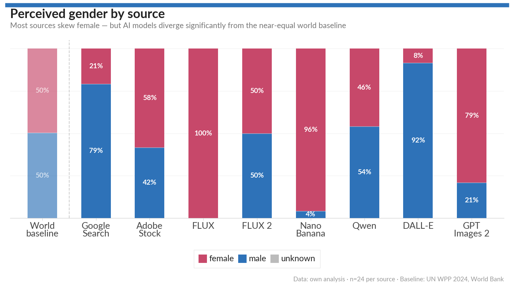

*(Key finding to be written. Preliminary: female 57%, male 43% overall, but with notable variation across sources.)*

### 4.2 Perceived ancestry cluster

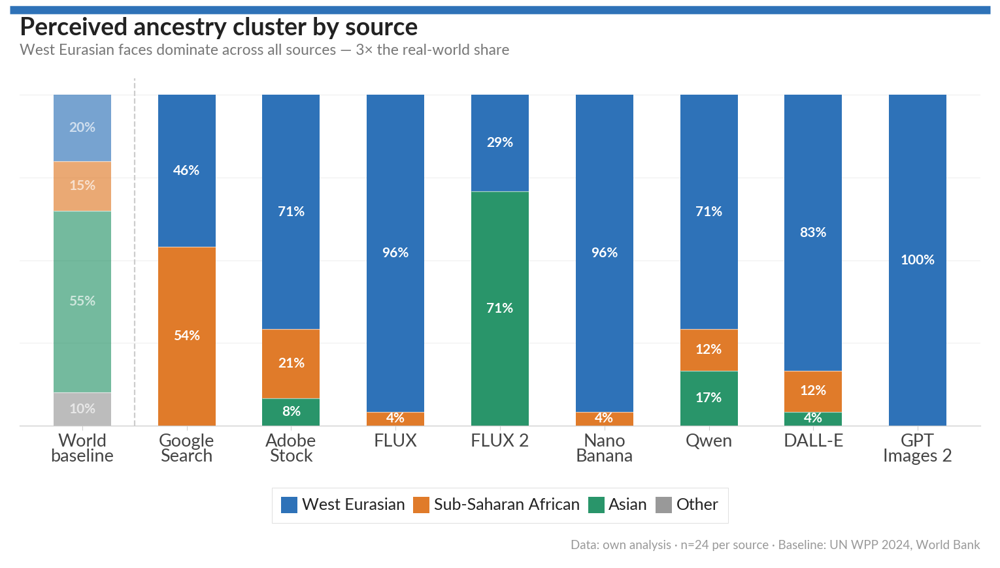

*(Key finding to be written. Preliminary: West Eurasian = 74% overall across all sources, Sub-Saharan African = 14%, East Asian = 11%, South Asian = 1%.)*

### 4.3 Skin tone

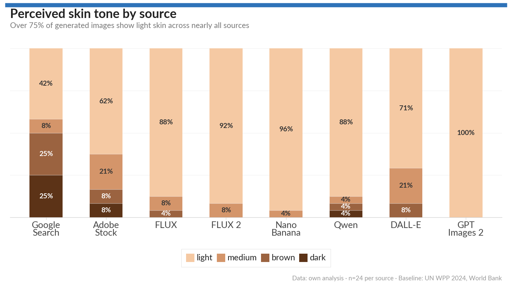

*(Key finding to be written. Preliminary: light skin tone = 80% overall.)*

### 4.4 Age distribution

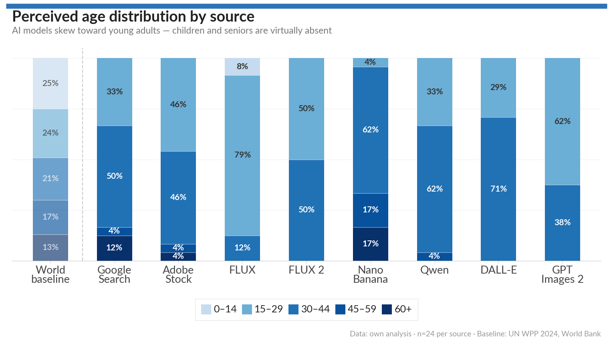

*(Key finding to be written.)*

### 4.5 Inter-model variation

*(Compare AI sources against each other: do they agree, or do individual models show stronger skews?)*

### 4.6 Intersectionality

*(Do gender and ancestry cluster interact? E.g. does a particular model skew toward a specific gender–ancestry combination?)*

---

## 5. Model Profiles

To complement the cross-source comparisons in Section 4, we present a per-model diversity profile for each source. Each profile shows, for a single source, the generated share for all measured categorical attributes for which a real-world baseline exists: perceived gender, perceived ancestry cluster, and age group. Skin tone is excluded from this analysis because no empirically grounded global baseline was identified (see Section 3.4).

For each attribute group, we also compute a **Diversity Gap Score**. The score combines two intuitions: distributional mismatch from the real-world baseline, and category collapse. The first component is normalized total variation distance:

`baseline_mismatch = (0.5 × Σ |generated_share_i − baseline_share_i|) / (1 − min(baseline_share_i))`

The second component captures whether the generated images collapse into a single category more strongly than the real-world baseline does:

`concentration_gap = (max(generated_share_i) − max(baseline_share_i)) / (1 − max(baseline_share_i))`

when `max(generated_share_i)` is larger than `max(baseline_share_i)`, and 0 otherwise. The final score is:

`score = 10 × max(baseline_mismatch, concentration_gap)`

where `i` runs over the categories in that attribute group. A score of 0 means the generated distribution exactly matches the baseline; a score of 10 means either maximum possible divergence from the baseline or complete collapse into one category. This makes the score comparable across attributes while preserving the intuitive interpretation that, for example, an all-female, all-male, or single-ancestry output set is maximally concentrated.

In these charts, the coloured bar shows the observed share in the generated sample, the label gives the count out of 24 images, and the black diamond marks the real-world baseline. The circular **GAP** badge reports the Diversity Gap Score for the full attribute group. This avoids compressing different baselines into a single normalized per-category score: for example, a category with a 10% baseline and 0 observed images remains visibly absent rather than being treated as a small generic deviation.

### 5.1 Google Search

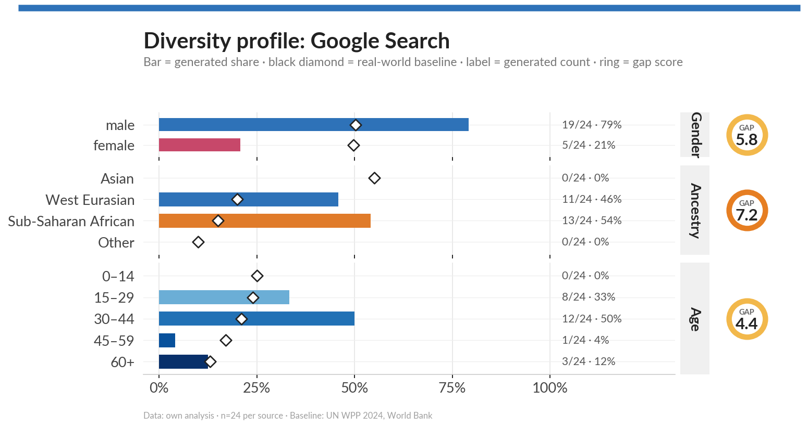

*(Key finding to be written.)*

### 5.2 Adobe Stock

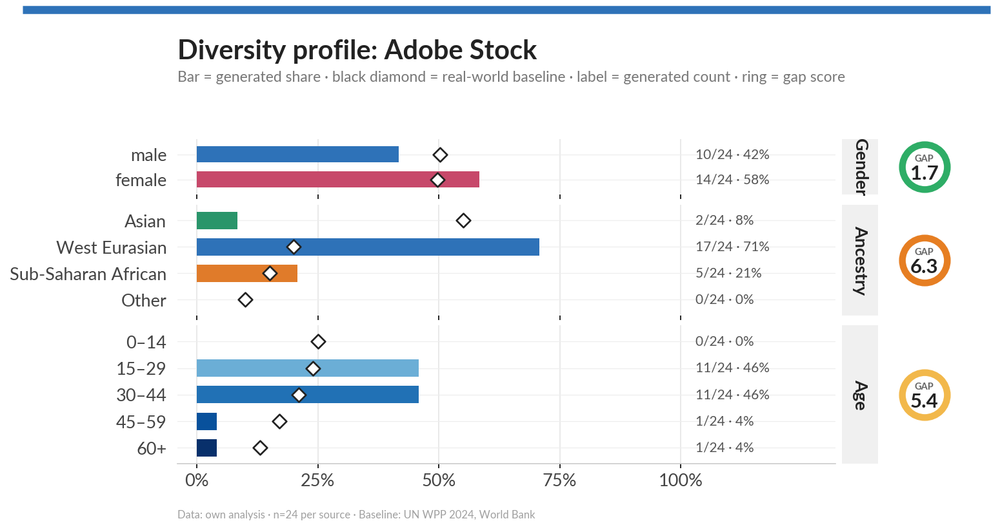

*(Key finding to be written.)*

### 5.3 FLUX

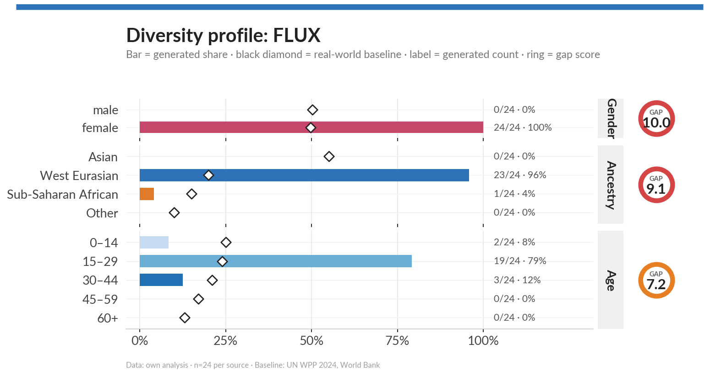

FLUX generates exclusively female images for the prompt "Person" (+50 pp above the near-equal baseline), and shows extreme West Eurasian overrepresentation (+76 pp). All other ancestry groups are underrepresented. In the age dimension, FLUX strongly concentrates on the 15–29 age group (+55 pp), with near-complete absence of children and seniors.

### 5.4 FLUX 2

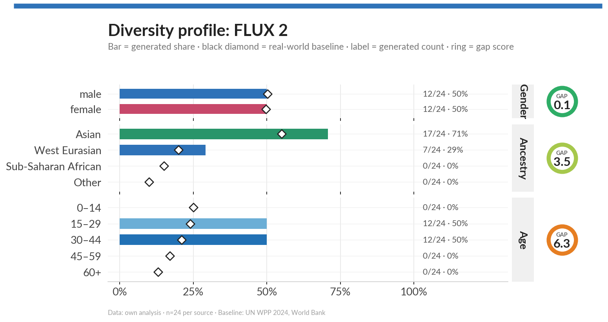

*(Key finding to be written.)*

### 5.5 NanoBanana

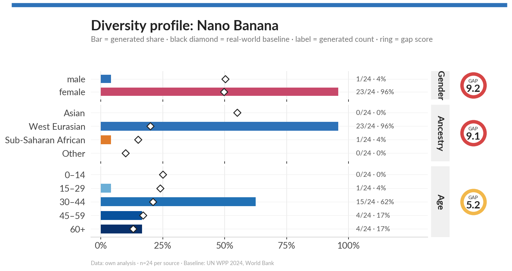

*(Key finding to be written.)*

### 5.6 Qwen

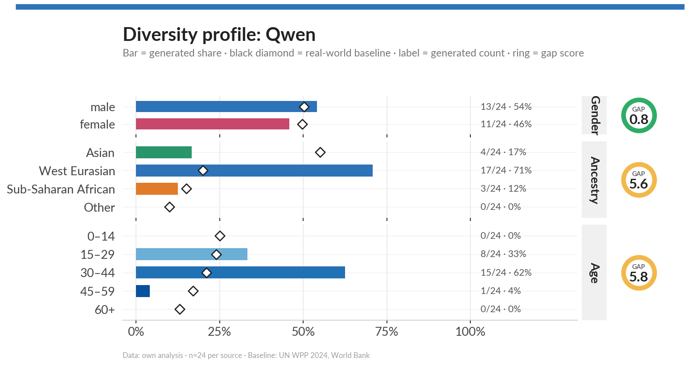

*(Key finding to be written.)*

### 5.7 DALL-E

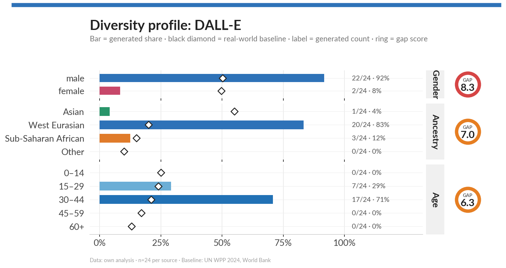

*(Key finding to be written.)*

### 5.8 GPT Images 2

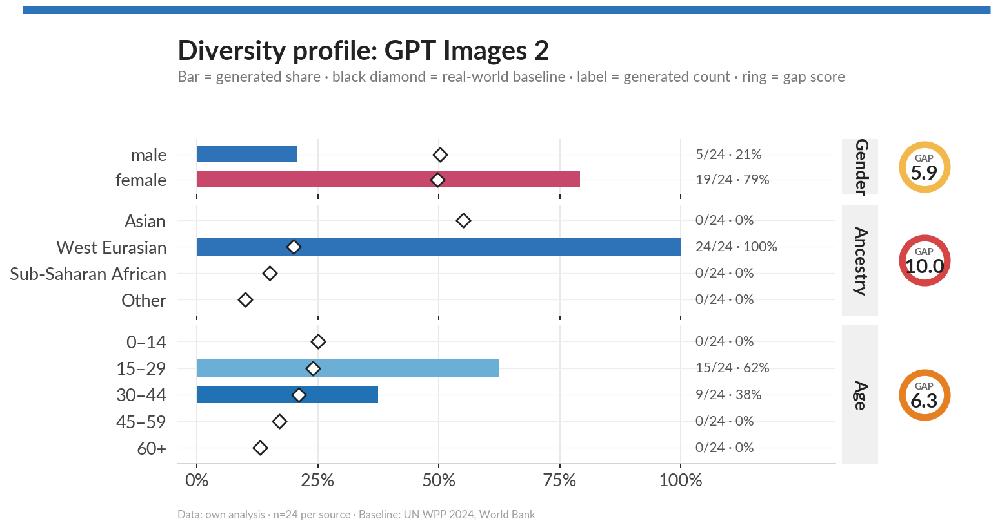

*(Key finding to be written.)*

---

## 6. Discussion

### 6.1 The three-layer framing

*(Discuss drift across layers: does AI amplify internet bias? Does internet imagery already diverge from world population? Where is the largest gap?)*

### 6.2 Invisible defaults

The central practical takeaway is that omitting demographic attributes from prompts does not produce neutral output — it produces *default* output shaped by the model's training data. Users who are unaware of this may inadvertently produce demographically skewed content. Making these defaults visible is a prerequisite for making informed decisions about when and how to specify attributes explicitly.

### 6.3 Implications for prompt design

*(Brief practical guidance: explicitly specifying attributes gives predictable results; relying on defaults does not.)*

---

## 7. Conclusion

*(To be written once results are complete.)*

---

## References

*(See `references.bib`.)*

---

*Appendix: Labeling prompt used for GPT-4o attribute extraction — see `Generate_Image_Labels_Prompt.txt` in the repository root.*
